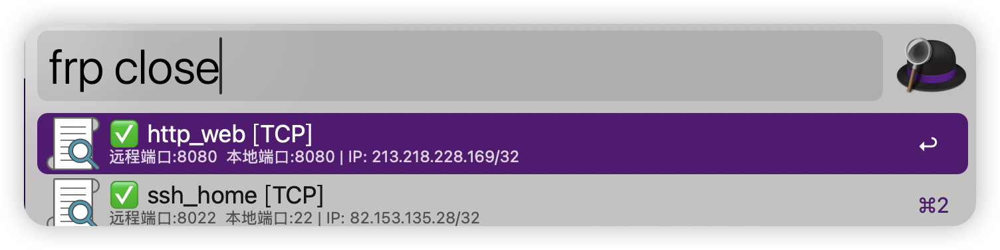

# Alfred Workflow - FRP 腾讯云安全组助手

## 简介
本项目为 Alfred Workflow，允许用户通过 Alfred 快速管理腾讯云安全组端口，适用于 frp 场景。

## 下载与安装
1. 直接下载本仓库提供的 .alfredworkflow 文件。
2. 双击下载的文件自动导入 Alfred。

## 变量设置（首次使用前请务必配置）
导入后，请在 Alfred 的 Workflow 设置界面，点击右上角「变量」按钮，设置以下变量：
- **BIN_PATH**：可执行文件路径，默认 `.`（一般无需修改）
- **FRPC_TOML_PATH**：frpc.toml 路径，默认 `~/.frp/frpc.toml`
- **SECURITY_GROUP_ID**：腾讯云安全组 ID，**必填**
- **LOG_PATH**：日志路径，默认 `~/.frp/alfred-frp.log`（可选）
- **REGION**：腾讯云地域，默认 `ap-guangzhou`，可选 `ap-shanghai` 或 `ap-guangzhou`，你可根据你的需求自行添加。

> ⚠️ 若未设置 SECURITY_GROUP_ID、FRPC_TOML_PATH 等变量，Workflow 将无法正常工作。

## 使用方法
- `frp open` 选择服务开放端口

- `frp close` 关闭已开放端口

- `frp list` 查看已开放规则

- `fc` 进行相关配置

